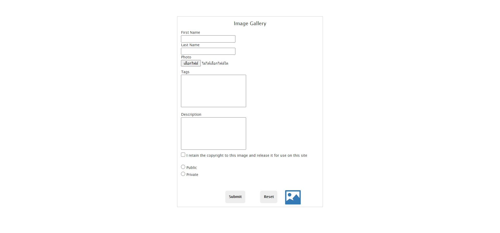
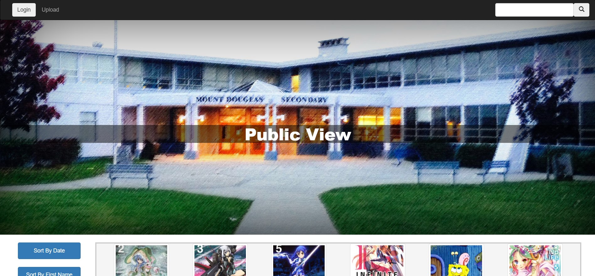
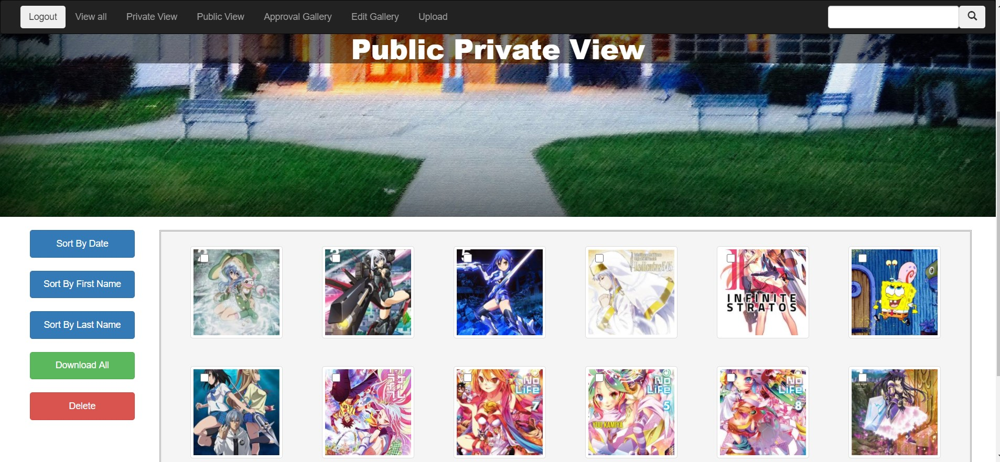
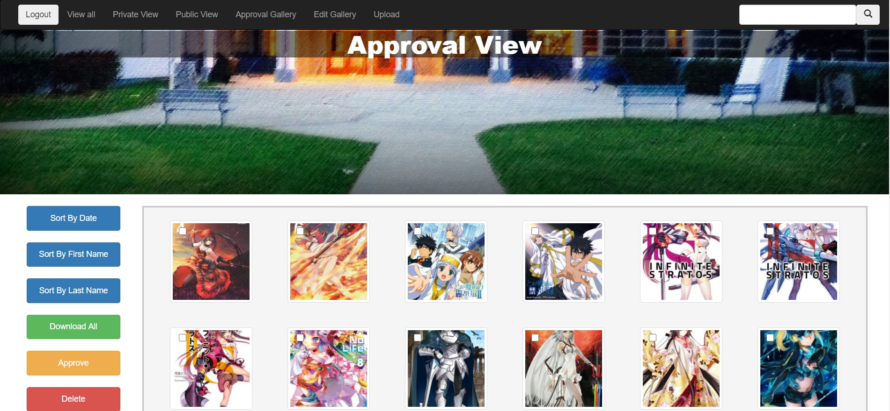
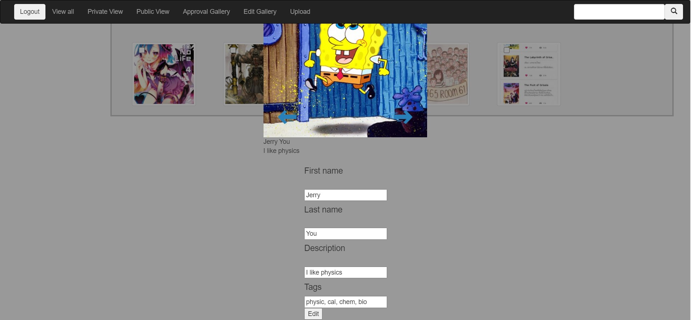

# Yearbook-Baby-Gallery
Yearbook Baby Gallery is a dynamic website that is utilized to display and manage photos. It means to give Yearbook's members an easier time to collect and manage photos uploaded by grad students.  

My partner and I had decided to carry on a final programming project before graduating from high school. Our programming teacher, who is a school Yearbook counselor, suggested this project to us, and we decided to do so.

Check out this link: [https://yearbook-gallery.herokuapp.com/](https://yearbook-gallery.herokuapp.com/)

## How does Yearbook Baby Gallery work?
### Upload Form
1. Ask users to upload their photo, descriptions and permission
2. Check the inputs submitted by users
3. Display an error message and return to the form, or process the form 
4. Create a thumbnail and a UID of the photo
5. Store all data in JSON arrays and the photos in images directories
6. Push photos and descriptions to the approval view in the site  and wait for approval

### Yearbook Baby Gallery website
1. Display all approved public thumbnails on the screen
2. Click a thumbnail to open a lightbox with an original image and descriptions
3. Click an arrow button to shift to a next/previous image, or click 'X' to close
4. Click 'Download' to download photo, 'Sort' to sort images, or 'Search' to search images
5. Log in to 'Login' session to access all views, Yearbook's members-only (YMO)
6. Display all public/private images separated by different views (YMO)
7. Approve waiting images, edit descriptions, and delete images(YMO)
8. Logout to a public view (YMO)   

## Key skills
* JavaScript
* PHP
* HTML/CSS/Boostrap
* JSON array
* JS Session
* JS Lightbox

## What is next for Yearbook Baby Gallery?
This is the latest version of the Yearbook Baby Gallery. However, some features can be improved.
1. Finish a login system
2. Using a database to store images and its description
3. Improve lightbox UI

## Example of UploadForm, Public, Private, approval and lightbox

### Upload Form

### Public View

### Private View

### Approval View

### Private Lightbox

